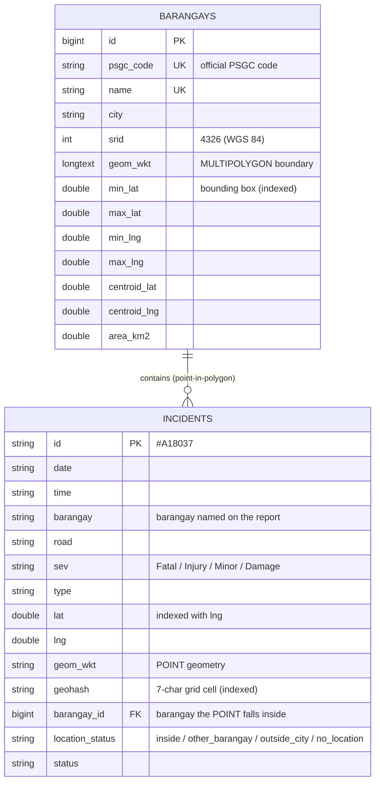

# MandaSafe spatial database schema

MandaSafe stores its data in SQLite. Spatial data follows the OGC Well-Known Text (WKT)
standard in the WGS 84 coordinate system (SRID 4326), the system GPS coordinates use.
Code: `laravel/app/Services/SpatialService.php`; migration:
`laravel/database/migrations/2026_09_30_000000_create_spatial_schema.php`.

## Entity–relationship diagram

## Spatial features

| Feature | How |
|---|---|
| Geometry storage | Boundaries as `MULTIPOLYGON`, accidents as `POINT`, both WKT with SRID 4326 |
| Spatial reference table | `barangays`: the 27 official boundaries loaded from the PSA/PSGC GeoJSON, with centroid and area (km²) |
| Spatial index — polygons | Bounding-box columns `min/max_lat`, `min/max_lng` (composite index) filter candidate barangays before the exact test |
| Spatial index — points | `geohash` (7 characters ≈ 150 m × 150 m cells), indexed; nearby search reads only the 3×3 block of cells around a point |
| Spatial join | `incidents.barangay_id` is set by a point-in-polygon test on the accident's coordinates, independent of the typed barangay name |
| Data validation | `location_status` flags records whose point is outside the city or inside a different barangay than the one named |
| Proximity query | `GET /api/spatial/nearby?lat=&lng=&radius=` — geohash prefix lookup, then exact great-circle (haversine) distance |
| Spatial aggregation | `GET /api/spatial/summary` — accidents inside each barangay polygon, accidents per km², mismatched records |
| Maintenance | `php artisan mandasafe:spatial-sync` reloads boundaries and re-locates every accident; the Incident model keeps the columns current on every create and edit |

## Why SQLite with WKT rather than a geometry extension

The deployment target runs PHP's bundled SQLite, which does not ship the SpatiaLite or R*Tree
modules. WKT keeps the geometry in the same open standard that PostGIS, MySQL and SpatiaLite
read (`ST_GeomFromText`), so the data moves to a spatial database unchanged if the system is
scaled up; the bounding-box and geohash indexes provide the query speed in the meantime.
